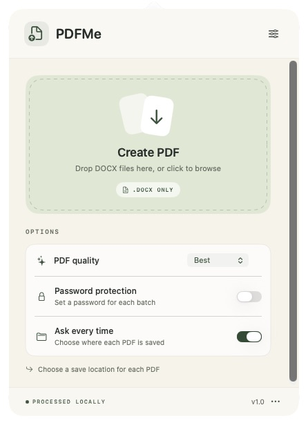

<div align="center">
  
  <h1>PDFMe</h1>
  <p><strong>DOCX to PDF from your menu bar.</strong></p>
  <p>A small, native macOS menu bar app that turns DOCX files into PDFs.<br>Local conversion with LibreOffice.</p>
  <p><a href="https://github.com/justinechang39/PDFMe/releases/latest">Download</a> · <a href="#getting-started">Get started</a> · <a href="CONTRIBUTING.md">Contribute</a></p>
  <p>  </p>
  
</div>

## Features

- **Drop onto the menu bar icon** or the **Create PDF** panel. Click to browse, or use Finder’s **Open With → PDFMe**.
- **DOCX only**, with helpful errors for unsupported or damaged files.
- **Saved beside the original** by default. Turn on **Ask every time** to choose a location for each document.
- **Small, Balanced, or Best** image quality. Text stays sharp and selectable.
- **Optional password protection.** Choose and confirm a password for each batch; it is never persisted or passed in command-line arguments.
- **Batch conversion**, honest stage-based progress, cancellation, completion notifications, and shortcuts to open or reveal results.
- **Existing files stay safe.** `Report.pdf` becomes `Report (2).pdf` if needed, even when a save dialog names an existing file.
- **Local processing.** No account, upload service, telemetry, or network API in PDFMe.
- Native **SwiftUI + AppKit**, keyboard-accessible controls, and support for Reduce Motion.

## Getting started

Requires **macOS 13 or later** and [LibreOffice](https://www.libreoffice.org/download/download-libreoffice/) in `/Applications` or `~/Applications`.

1. Install LibreOffice (or run `brew install --cask libreoffice`). You do not need to open it for each conversion.
2. Download the ZIP matching your Mac from [Releases](https://github.com/justinechang39/PDFMe/releases). `arm64` is for Apple silicon; `x86_64` is for Intel when available.
3. Unzip and move **PDFMe.app** into Applications.
4. Open PDFMe. Its document icon appears in the menu bar. Drop a `.docx` file on it.

The initial community build is **ad-hoc signed, not Apple-notarized**. macOS may block a downloaded copy. After trying to open it, use **System Settings → Privacy & Security → Open Anyway** if you trust the release, or build from source. Do not disable Gatekeeper globally. The app does not automatically launch at login; add it under macOS Login Items if desired.

Allow notifications when macOS asks if you want completion banners. Results also appear inside PDFMe regardless of notification permission. Documents from iCloud or another cloud drive must be downloaded before conversion.

## Which quality should I choose?

| Preset | Images | Good for |
| --- | --- | --- |
| Small | JPEG quality 75, downsample to 150 dpi | Email and everyday sharing |
| Balanced (default) | JPEG quality 90, downsample to 300 dpi | Most documents and printing |
| Best | Lossless, original resolution | Detailed images and graphics |

These settings affect images, not the resolution of text. The actual size difference depends on the source document. A text-only document may have almost the same size in every preset.

PDFMe uses LibreOffice’s Word import and PDF export engine. Complex layouts, unavailable fonts, fields, or Word-specific features can differ from Microsoft Word’s rendering. Check important documents before sharing. This is not a PDF/A, digital-signature, accessibility-certification, redaction, or permissions-management tool. Existing comments are not exported as PDF notes.

## Passwords and privacy

Password protection requires at least eight characters and matching confirmation. One password applies to the current batch only. macOS PDFKit encrypts the output; PDFMe verifies that it is locked and can be reopened with the supplied password before publishing it. It does not claim a particular encryption algorithm across macOS versions. Passwords are not written to preferences, logs, or process arguments; they exist in memory for the batch. Swift strings do not guarantee cryptographic memory erasure.

Conversion uses a private temporary workspace and isolated LibreOffice profile, with macros and automatic linked-content updates disabled. Temporary copies are removed after success, failure, or cancellation. A force quit or machine crash can leave temporary files for macOS to clean up; cleanup is not secure disk erasure. LibreOffice runs with your user permissions and is a separately installed dependency, not a security sandbox. PDFMe itself makes no network requests; untrusted documents should always be treated with care.

Recent results are in memory only and disappear when PDFMe quits. Only quality, protection, and save-location preferences persist. Output files receive owner-only file permissions; originals are never edited. Completed PDFs remain after cancelling a batch.

## Build from source

Apple Command Line Tools with Swift 5.9 or later are sufficient to build. No third-party Swift packages are required.

```sh
git clone https://github.com/justinechang39/PDFMe.git
cd PDFMe
./scripts/build.sh
open dist/PDFMe.app
```

The script makes an app bundle and ZIP for the current Mac’s architecture, then ad-hoc signs the app. Set `CODE_SIGN_IDENTITY` to your own signing identity if you maintain a distribution build. Developer ID signing, hardened runtime, and notarization are release-maintainer responsibilities and are not configured by this script.

```sh
# Real conversion, encryption, cancellation, and file-safety checks:
./scripts/test.sh

# XCTest suite (requires full Xcode selected and licensed):
swift test
```

Both test paths need LibreOffice for conversion checks; XCTest skips those tests when it is absent. The standalone tests generate sample documents under ignored `work/` and retain PDFs for visual inspection. CI installs LibreOffice and runs both suites.

## How it works

`PDFMe` owns the menu bar, native drop target, SwiftUI panel, queue, save dialogs, and notifications. `PDFMeCore` validates DOCX packages, runs LibreOffice asynchronously with a two-minute timeout, checks the resulting PDF, optionally applies password protection using PDFKit, and stages the final file on the destination volume. An atomic exclusive hard link publishes it without overwriting a file, including a concurrent naming collision. Destinations must support hard links (the usual macOS APFS/HFS+ disks do); unsupported volumes produce an error instead of risking replacement.

See [LibreOffice’s PDF export parameters](https://help.libreoffice.org/latest/en-US/text/shared/guide/pdf_params.html) for the image-quality settings used by the app.

## Open source

[MIT licensed](LICENSE), copyright © 2026 Justine Chang. Contributions and [issues](https://github.com/justinechang39/PDFMe/issues) are welcome. See [CONTRIBUTING.md](CONTRIBUTING.md), [SECURITY.md](SECURITY.md), and [THIRD_PARTY_NOTICES.md](THIRD_PARTY_NOTICES.md).
