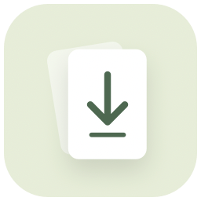

<div align="center">
  
  <h1>PDFMe</h1>
  <p><strong>Create and print PDFs from your menu bar.</strong></p>
  <p>A native macOS menu bar app for DOCX conversion and PDF printing.<br>Saved print templates, collated batches, and local processing.</p>
  <p><a href="https://github.com/justinechang39/PDFMe/releases/latest">Download</a> · <a href="#getting-started">Get started</a> · <a href="CONTRIBUTING.md">Contribute</a></p>
  <p>  </p>
</div>

## Features

- **Drop onto the menu bar icon** or the **Create PDF** panel. Click to browse, or use Finder’s **Open With → PDFMe**.
- **Separate workflows:** DOCX only for Create PDF; PDF only for Print PDF. The menu bar icon routes a single-format batch to the appropriate workflow.
- **Saved beside the original** by default. Turn on **Ask every time** to choose a location for each document.
- **Small, Balanced, or Best** image quality. Text stays sharp and selectable.
- **Optional password protection.** Choose and confirm a password for each batch; it is never persisted or passed in command-line arguments.
- **Batch conversion**, honest stage-based progress, cancellation, completion notifications, and shortcuts to open or reveal results.
- **Existing files stay safe.** `Report.pdf` becomes `Report (2).pdf` if needed, even when a save dialog names an existing file.
- **Local processing.** No account, upload service, or telemetry. Printing sends the prepared job through macOS to the printer you explicitly select.
- Native **SwiftUI + AppKit**, keyboard-accessible controls, and support for Reduce Motion.

## Getting started

Requires **macOS 13 or later**. DOCX conversion additionally requires [LibreOffice](https://www.libreoffice.org/download/download-libreoffice/) in `/Applications` or `~/Applications`. PDF printing uses the built-in macOS print system and an installed printer; LibreOffice is not needed for printing.

1. For DOCX conversion, install LibreOffice (or run `brew install --cask libreoffice`). Printing PDFs does not require LibreOffice.
2. Download the ZIP matching your Mac from [Releases](https://github.com/justinechang39/PDFMe/releases). `arm64` is for Apple silicon; `x86_64` is for Intel when available.
3. Unzip and move **PDFMe.app** into Applications.
4. Open PDFMe. Its document icon appears in the menu bar. Drop a `.docx` file on it.

The initial community build is **ad-hoc signed, not Apple-notarized**. macOS may block a downloaded copy. After trying to open it, use **System Settings → Privacy & Security → Open Anyway** if you trust the release, or build from source. Do not disable Gatekeeper globally. The app does not automatically launch at login; add it under macOS Login Items if desired.

Allow notifications when macOS asks if you want completion banners. Results also appear inside PDFMe regardless of notification permission. Documents from iCloud or another cloud drive must be downloaded before conversion.

## Print PDF

Click **Print PDF** below Create PDF, or drop one or more PDFs on that target or the menu bar icon. Dropping files opens a review; it never prints automatically. DOCX files are rejected by the print target.

1. Add the PDFs you want to print.
2. Choose a saved template and the printer. Adjust settings for this job if needed.
3. Set **Copies** on each PDF row. Drag the handle on the right to change the file order; each document’s copies stay together.
4. Click **Preview** to inspect the prepared sheet layout in macOS Preview.
5. Click **Print** to send one job to the selected printer.

### Templates

The first time you open printing, PDFMe creates a basic template for your system default printer. If that printer supports A4 and duplex, it also creates **A4 · 2-up duplex**: A4 landscape, two portrait pages side by side, short-edge duplex, print as image at 300 dpi. No personal printer identifiers are bundled with the app.

Use **Manage templates** (the sliders icon) to name a template, **Save** changes, **Save as new**, delete a template, or **Use as default**. Templates are stored locally and include:

- Printer and paper size (A4, Letter, A5, Legal, or A3 where supported).
- Portrait/landscape, one-sided or long-/short-edge duplex.
- One, two, or four pages per side, in left-to-right/top-to-bottom order.
- Color or black and white, where advertised by the printer driver.
- Print as image and image resolution (150, 300, or 600 dpi).
- Whether each PDF starts on a fresh physical sheet.

Unsaved setting changes affect the current job only. Copy counts are set separately for each PDF in the current job and are not stored in templates. A missing saved printer must be explicitly replaced; PDFMe does not silently redirect jobs to a different printer. Unsupported paper, color, or duplex options block submission instead of silently changing the template.

### Layout and collation

For example, with two copies of A and one copy of B, the job contains **A, A, B**, with every document’s pages in order. Copies are included in the prepared PDF, so **Preview** shows the complete job. Repeated copies of a document always start on separate physical sheets. With **Start each PDF on a new sheet**, PDFMe also keeps different documents on separate sheets, adding blank backs where necessary for duplex. Turn it off to let different PDFs share a sheet. The sheet total includes all requested copies and any blank backs.

Two-up places pages side by side on each printed side; it is not booklet imposition. Landscape and short-edge duplex normally produce the expected left/right page turning for this arrangement. Printer drivers can differ, so test one sheet before a large run.

PDFMe composes the sheet layout itself with an 18-point outer margin and 12-point gap, preserving source page aspect ratios, crop boxes, rotations, and printable annotations. The printer fits the prepared sheet to its printable area, so the physical scale can differ slightly from the preview. This release does not offer actual-size technical drawing output, custom margins, finishing/stapling, manual duplex, or page-range selection.

**Print as image** rasterizes each composed side at the selected resolution before spooling. This can help with PDFs whose fonts or graphics print incorrectly, but can be slower and produce larger jobs. It preserves the original files. Extremely large paper/resolution combinations are blocked with a prompt to lower resolution to limit memory usage.

### Queue status and privacy

A success notification means **submitted to the system queue**, not physically printed. The printer can still be offline, paused, out of paper, or require attention. PDFMe shows the job ID, provides a link to **Printers & queues**, and can request cancellation of its own submitted job. Sheets already printed cannot be recalled. After a timeout or an ambiguous spooler reply, check the queue before retrying to avoid duplicate copies.

Locked PDFs and PDFs that prohibit printing are rejected. Source PDFs are never edited. Temporary print files live in a private directory and are removed after spooling; preview files are retained for the current app session until the list is cleared or PDFMe quits. The macOS print spooler manages its own copies. A crash can leave temporary files for macOS to clean up. Saved templates contain local printer names/IDs and preferences, not the dropped files or their paths.

## Which conversion quality should I choose?

| Preset | Images | Good for |
| --- | --- | --- |
| Small | JPEG quality 75, downsample to 150 dpi | Email and everyday sharing |
| Balanced (default) | JPEG quality 90, downsample to 300 dpi | Most documents and printing |
| Best | Lossless, original resolution | Detailed images and graphics |

These settings affect images, not the resolution of text. The actual size difference depends on the source document. A text-only document may have almost the same size in every preset.

PDFMe uses LibreOffice’s Word import and PDF export engine. Complex layouts, unavailable fonts, fields, or Word-specific features can differ from Microsoft Word’s rendering. Check important documents before sharing. This is not a PDF/A, digital-signature, accessibility-certification, redaction, or permissions-management tool. Existing comments are not exported as PDF notes.

## Passwords and privacy

Password protection requires at least eight characters and matching confirmation. One password applies to the current batch only. macOS PDFKit encrypts the output; PDFMe verifies that it is locked and can be reopened with the supplied password before publishing it. It does not claim a particular encryption algorithm across macOS versions. Passwords are not written to preferences, logs, or process arguments; they exist in memory for the batch. Swift strings do not guarantee cryptographic memory erasure.

Conversion uses a private temporary workspace and isolated LibreOffice profile, with macros and automatic linked-content updates disabled. Temporary copies are removed after success, failure, or cancellation. A force quit or machine crash can leave temporary files for macOS to clean up; cleanup is not secure disk erasure. LibreOffice runs with your user permissions and is a separately installed dependency, not a security sandbox. DOCX conversion makes no network requests from PDFMe; printing explicitly submits to your chosen printer through macOS; untrusted documents should always be treated with care.

Recent results are in memory only and disappear when PDFMe quits. Quality, protection, save-location preferences, and print templates persist. Output files receive owner-only file permissions; originals are never edited. Completed PDFs remain after cancelling a batch.

## Build from source

Apple Command Line Tools with Swift 5.9 or later are sufficient to build. No third-party Swift packages are required.

```sh
git clone https://github.com/justinechang39/PDFMe.git
cd PDFMe
./scripts/build.sh
open dist/PDFMe.app
```

The script makes an app bundle and ZIP for the current Mac’s architecture, then ad-hoc signs the app. Set `CODE_SIGN_IDENTITY` to your own signing identity if you maintain a distribution build. Developer ID signing, hardened runtime, and notarization are release-maintainer responsibilities and are not configured by this script.

```sh
# Real conversion, encryption, cancellation, and file-safety checks:
./scripts/test.sh

# Print layout, rasterization, collation, and printer-option checks; prints no paper:
./scripts/test-print.sh

# XCTest suite (requires full Xcode selected and licensed):
swift test
```

Both test paths need LibreOffice for conversion checks; XCTest skips those tests when it is absent. The standalone tests generate sample documents under ignored `work/` and retain PDFs for visual inspection. CI installs LibreOffice and runs the conversion and print checks. Print checks never call the submission API or require a physical printer.

## How it works

`PDFMe` owns the menu bar, native drop target, SwiftUI panel, queue, save dialogs, and notifications. `PDFMeCore` validates DOCX packages, runs LibreOffice asynchronously with a two-minute timeout, checks the resulting PDF, optionally applies password protection using PDFKit, and stages the final file on the destination volume. An atomic exclusive hard link publishes it without overwriting a file, including a concurrent naming collision. Destinations must support hard links (the usual macOS APFS/HFS+ disks do); unsupported volumes produce an error instead of risking replacement.

Printing uses PDFKit/Core Graphics for composition and the macOS `lpstat`, `lpoptions`, `lp`, and `cancel` tools with argument arrays rather than shell commands. N-up and per-file copy counts are applied during composition, and the complete prepared PDF is submitted exactly once with explicit print options. Printer defaults are queried but never changed.

See [LibreOffice’s PDF export parameters](https://help.libreoffice.org/latest/en-US/text/shared/guide/pdf_params.html) for the image-quality settings used by the app.

## Open source

[MIT licensed](LICENSE), copyright © 2026 Justine Chang. Contributions and [issues](https://github.com/justinechang39/PDFMe/issues) are welcome. See [CONTRIBUTING.md](CONTRIBUTING.md), [SECURITY.md](SECURITY.md), and [THIRD_PARTY_NOTICES.md](THIRD_PARTY_NOTICES.md).
